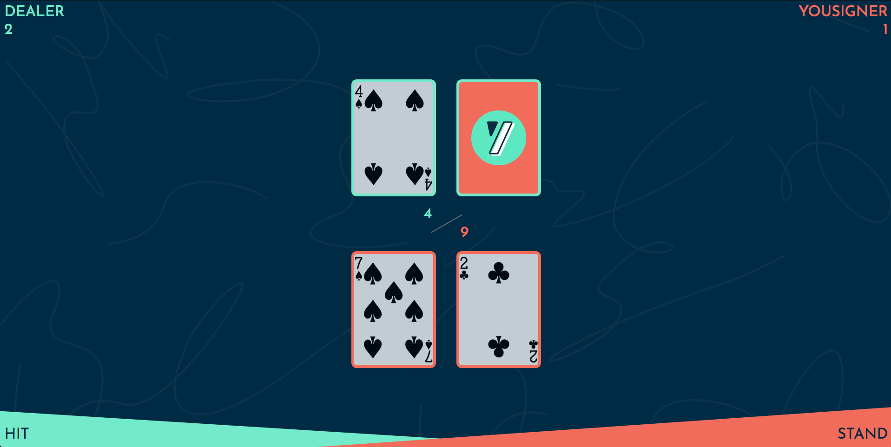

# Yousign BlackJack

Technical test for [Yousign](https://yousign.com/en-eu)

Live project: [Yousign Blackjack](https://blackjack.mokokom.com/).

## Overview

The goal is to make a responsive game on the Chrome browser of single-player Blackjack using this API: [deckofcardsapi](https://deckofcardsapi.com) which will manage all the shuffling and drawing of random cards.

[Rules](https://www.casinoonlinefrancais.info/blackjack/regles-du-jeu.html)

## Technology

React Hooks, JSX, CSS, HTML

## Requirements
- [x] Make the app responsive
- [x] Use [deckofcardsapi](https://deckofcardsapi.com)
- [x] Shuffle the game
- [x] Two buttons, one to "Hit" and one to "Stand"
- [x] The player can draw as many cards as desired, as long as the sum does not exceed 21
- [x] Once the player has clicked on "Stand," the bank, an AI, will play
- [x] The bank will draw cards until it wins or loses
- [x] In the event of a tie, the bank also wins
- [x] At the end, the game will be thrown, and a new one will be created to be able to replay.

